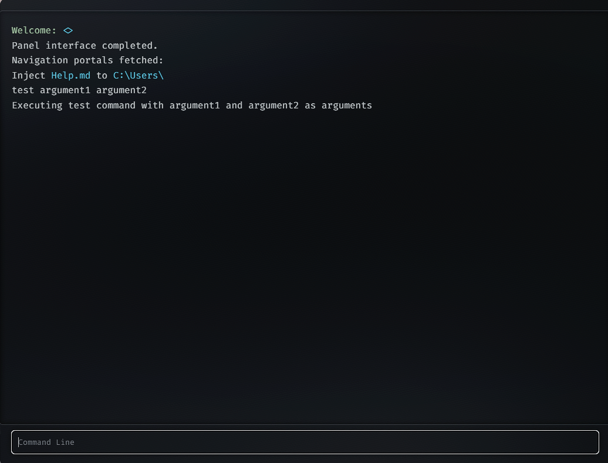

# GHS_HTerminal Usage

Welcome to the usage guide for **GHS_HTerminal**, a hacking terminal for FiveM.

# THIS IS STILL BETA I WILL UPDATE IT WITH COOL FEATURES SOON I JUST POSTED IT FOR PEOPLE WHO WANT A START FOR THIS KIND OF SCRIPT !

## Usage

### Starting the Terminal

The default i add to test it is command:
```bash
/hack
```
And the Client Event :
```lua
TriggerEvent('hacking:showUI')
```
Server Event : 
```lua
TriggerClientEvent('hacking:showUI', source)
```

### Features

- **Custom Commands**: You can add your custom ideeas with terminal.

### Examples

Here are some examples of how to use GHS_HTerminal:


- **ghs_hterminal/shared/commands ADD**

```lua
Commands.test = function()
    return "Executing test command"
end
```

- **ghs_hterminal/client/client.lua EDIT | Line 46**

```lua
RegisterNetEvent('hacking:commadnOutput')
AddEventHandler('hacking:commadnOutput', function(command, args, args2, output)
    if command == 'test' then
        local outputfinal = "Executing test command with " .. args .. " and " .. args2 .. " as arguments"
        SendNUIMessage({
            type = "TERMINAL_OUTPUT",
            output = outputfinal
        })
    else
        SendNUIMessage({
            type = "TERMINAL_OUTPUT",
            output = output
        })
    end
end)
```



### Troubleshooting

If you encounter any issues, please refer to the [FAQ](#faq) section or open an issue on GitHub.


## FAQ

**Q**: I have an ideea where i can say it?  
**A**: You can contact me on github i am free for some ideeas.

**Q**: I edited it better than u done i can show you?  
**A**: Allways i am free to take pull requests.

## Contributing

We welcome contributions! Please see our [contributing guidelines](CONTRIBUTING.md) for more details.

## License

This project is licensed under the MIT License. See the [LICENSE](LICENSE) file for more information.
